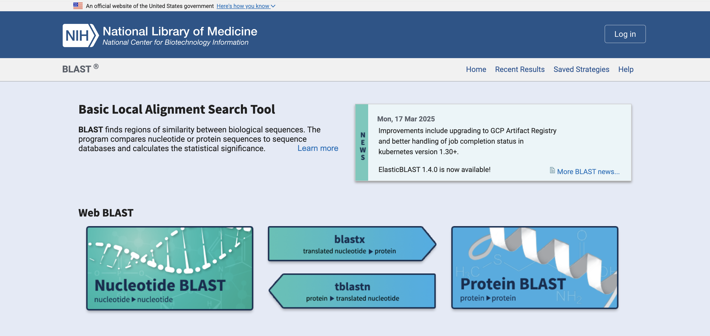
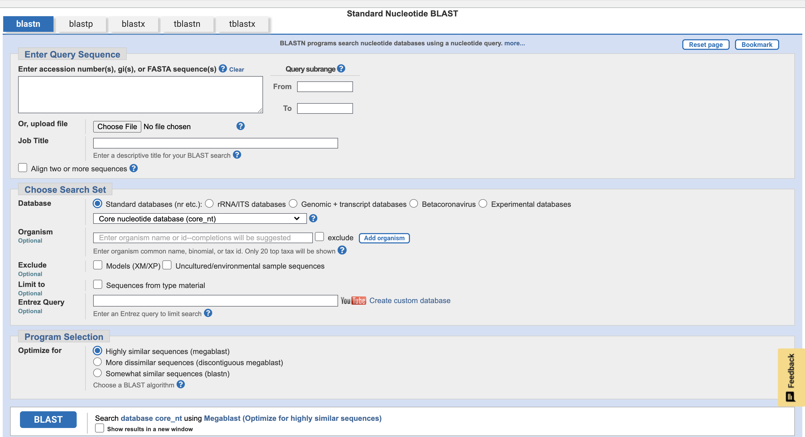
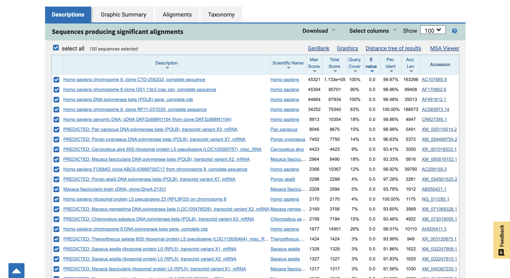

```{r setup, include=FALSE}
knitr::opts_chunk$set(echo = TRUE)
```

## Table of Contents

-   [Exploring Data](#exploring-data)
-   [Principal Components](#principal-components)
-   [Dendrograms](#dendrograms)
-   [Conclusion](#conclusion)
-   [Resources](#resources)

## Exploring Data {#explore}

### What is our goal?

In the `Sequences` directory, there are 10 files with the names gene_a-j.Each one of these files is a DNA sequence of a specific gene from a specific organism, and our job is to figure out what those genes and organisms are. A good starting point is to use a tool from the National Center for Biotechnology Information (NCBI) called Basic Local Alignment Search Tool (BLAST).

### A quick refresher on BLAST

BLAST is an incredibly useful and cool tool. We covered how BLAST works in a little more detail during the lecture, but as a quick reminder it basically tells us how similar a sequence we provide (called the query) is to the other sequences on NCBI. In 2023, NCBI GenBank had over 2.9 billion sequences for over half a million species, and that number has only grown! I don't think its hyperbole to say that most of the known genetic sequence in the world is hosted on NCBI, and we can search through it all.

### Using NCBI BLAST to identify our sequences

To try and identify what these genes are, let's try using BLAST. When you go to the [BLAST website](https://blast.ncbi.nlm.nih.gov/Blast.cgi) you should see something like this:



Click on the nucleotide BLAST button so that we can compare nucleotides to other nucleotides. That page looks like this:



Inside of this page, copy the sequence for gene A and paste it into the box that says enter query sequence. Then scroll down and click the large blue BLAST button!

You'll see a loading screen that looks like this:


This may take a few seconds, but remember we are searching for matches across all of the \> 2.9 billion sequences hosted by NCBI, so this speed is incredibly impressive.

When it is complete, scroll down a little and you will see a list of sequences that match. **Note:** The following image is NOT gene A, it is a different sequence I used as an example.



The results will be separated into columns, with the first column being the description of the sequence and the second being the scientific name of the organism. The other columns to par the most attention to are E value (lower is better), percent identity (higher is better), and accession length (higher is better). Typically, the best match will be the top result, but that isn't always the case! It's important to look through several of the better results to try and determine your sequence identity.

Do this for every gene in the sequences list, there are 10 total (a-j). Create a Google Sheet with the following headers and fill out the information for each gene:

1.  Gene
2.  Scientific Name
3.  Common Name (**Note:** to identify the common name of the organism, try Google the scientific name you discover.)
4.  Organism Category (**Note:** These are broad classifications that make sense to you. For example, if an organism is a bear, a nice broad classification may be mammal.)
5.  Gene Name (**Note:** This will be in the description.)
6.  Gene Function (**Note:** This will probably take some light research. Feel free to Google the gene name you uncover.)

Feel free to work as a group!

Once you finish doing this, lets discuss some questions as a group:

1.  What did you notice about the genes?

2.  How is this possible?

3.  Why may this be the case?

## Principal Components {#pcs}

Now that we know what these genes are, we may also want to find out how these genes are related to one another. One way we can do that is by looking at principal components (PCs). We talked a little about PCs already during the lecture, but the basics are that principal components explain the variance of the variables. So in the scatter plot, if points are close together, they are more similar. If points are farther apart, they are less similar. Let's calculate PCs and plot to see how these may be related.

### Load modules

Here are the modules we need to load so that we can plot our PCA. All of these should be available in [Pickcode](https://pickcode.io/)!

```{python}
import pandas as pd
import numpy as np
from collections import Counter
from itertools import product
import matplotlib.pyplot as plt
```

### Generating our data table

Please copy and paste this code chunk! This code is creating a data table with the gene name and the first 500 nucleotides of DNA sequence from each gene. We want to make sure that we are all using the same sequences and that these sequences are correct. Normally, we would download and load the data directly so that we can use the entire gene sequence, but this should be okay for our purposes.

```{python}
# Lets create a dictionary with two columns: "Gene" and "Sequence"
data = {
    "Gene": ["A", "B", "C", "D", "E", "F", "G", "H", "I", "J"],
    "Sequence": [
        "CGAGAACCCAGAAGACCTTTAATCTCCCGCCTCTTTCACACCATCAGACTCCATTATCGAAGCTCGTTCACTCTTCTCTCTCTCCAAATTCGAGAGAAAGGAGGAGGAAGGTGTAATGCCGCGTAAACCTAGACATCGTGTACCGGAGATTCTATGGAGGTTATTCGGAAACAGAGCCAGGAATTTAAACGACGCAATAGTAGATCTGATTCCTAACCGGAATATCCAGCCGGAGCAATGCCGATGCCGGGGTCAAGGTTGTCTCGGTTGCAGCAGCGATAAACCGGCGTTTCTGCTGCGTTCCGATGATCCCATTCACTACCGTAAACTTCTTCACCGTTGCTTCGTTGTACTTCACGAACAAACCCCTCCGCTTCTGGATTTCTCTCCAACATCTTGGTGGTCACAGAGAGAGATTGTTGAAAGGATTATTGAAATGATGCAATCTGGATGTGATTGCCAAAATGTGATATGTGCCAGATATGATAAGTATGATCAGT",
        "CTCTCCTCGCGGCGCGAGTTTCAGGCAGCGCTGCGTCCTGCTGCGCACGTGGGAAGCCCTGGCCCCGGCCACCCCCGCGATGCCGCGCGCTCCCCGCTGCCGAGCCGTGCGCTCCCTGCTGCGCAGCCACTACCGCGAGGTGCTGCCGCTGGCCACGTTCGTGCGGCGCCTGGGGCCCCAGGGCTGGCGGCTGGTGCAGCGCGGGGACCCGGCGGCTTTCCGCGCGCTGGTGGCCCAGTGCCTGGTGTGCGTGCCCTGGGACGCACGGCCGCCCCCCGCCGCCCCCTCCTTCCGCCAGGTGGGCCTCCCCGGGGTCGGCGTCCGGCTGGGGTTGAGGGCGGCCGGGGGGAACCAGCGACATGCGGAGAGCAGCGCAGGCGACTCAGGGCGCTTCCCCCGCAGGTGTCCTGCCTGAAGGAGCTGGTGGCCCGAGTGCTGCAGAGGCTGTGCGAGCGCGGCGCGAAGAACGTGCTGGCCTTCGGCTTCGCGCTGCTGGACGG",
        "GTTCCCAGCCTCATCTTTTTCGTCGTGGACTCTCAGTGGCCTGGGTCCTGGCTGTTTTCTAAGCACACCCTTGCATCTTGGTTCCCGCACGTGGGAGGCCCATCCCGGCCTTGAGCACAATGACCCGCGCTCCTCGTTGCCCCGCGGTGCGCTCTCTGCTGCGCAGCCGATACCGGGAGGTGTGGCCGCTGGCAACCTTTGTGCGGCGCCTGGGGCCCGAGGGCAGGCGGCTTGTGCAACCCGGGGACCCGAAGATCTACCGCACTTTGGTTGCCCAATGCCTAGTGTGCATGCACTGGGGCTCACAGCCTCCACCTGCCGACCTTTCCTTCCACCAGGTGGGCCTCCAGGCGGGATCCCCATGGGTCAGGGGCGGAAAGCCGGGAGGACGTGGGATAGTGCGTCTAGCTCATGTGTCAAGACCCTCTTCTCCTTACCAGGTGTCATCCCTGAAAGAGCTGGTGGCCAGGGTTGTGCAGAGACTCTGCGAGCGCAACGAG",
        "CCAATGCTTACACAGGCTAGAATCATCACAACCTTCATTTTTGTCCCAAATTATGATCTCAGATTGCCGTTGCTATAAATTTTGGAATTGTATTGGAAACTGTAACTGTGCGAAGGAGGGGATCTTTAATCCTAGTAAATCCAAAATCGGTTCACATAATCGACTTTTTCGTCATTGGATTTATTGGCTTTTTTCTTCTGTAGTGGTACCCGTTATCAGTAATTGTTTTTATGTTACTGAAAGGCAATTTGATAAGCTGCAAGTTTTTTATTATCCTAAACCTGTGTGGAAGATGTTAGCAGATAATGCCACCGTCTATTTGAAGGAACATAATTATGAACAATTGAATGCTGTGTCTTACATGTCTATAATTACGAAGAGGAAATTTGGTTTTTCAAGGGTGAGATTTTTACCAAAGAAAAATAAAATGCGGATAGTGGCAAATACTAAGGCACCATGTGAGATAAAAACTTCCGATCAAAGAAAGAAAAGTTTTTTTG",
        "GGCACGAGGCCAGCTCTGTCCCGAGCGCCCGTCCGTCCAGGGCTCTGCCGGCCGTCCGTCCAGGGCTCCGCCGGCCGCCTATCCGGGGGACCGCCGGCCTGCCAGCCGTCCGTCCAGGGGCAGCGCCGCCGGCCGCCCGTCCAGGGCACCACCACCTCGCCATCGACCGTCCATCCAGGTCACCCCGACGACGACGTGTGCTGCTACTGCTGATTCACTTTGAGGTGCACGATAGCTGGTGGAAGGGAAAGGCCAAAAGGGAGAAGAAAACGAGAAAATAAAAGTTTCAGGCGCCGCTTCAAAATCCCGCCTCAAACGGTCAAAAGCCCCTGATCCCCCTTTCCCCTACCGGGCCTCTCCGCTGCCGCCTCATCCTCCACCCCCCTCACTTTCCTGTCGCGATGCCACGGCGGCGGCGGCGGCGGCGTGCGGCACCCGGCGGCCAAGTTCCCCCAGAGCTACGCCTGGCTTATGGCGCCCGCGCGCTCACGCTCGGCCGC",
        "ATGGCTACGAGTAAGACGCGAGCGGGAATTCGACGCGAACGGAGGGCGCGAAAGCGACGCCAAGATGAAGAGGCGGCAGAGAATTGCGCGTTGGAGACCGATTCCACCATGCTTGAGTCGAAGTGCATGTCCGAAAAGCCGCTCACCGCGAACCCATTCATTTCGCACATCGACGTGAAGGAAGTCATTCGATTGAGCGACGTCTATCGTTGTTCACAAGATGTCTCAGTCGACGGGGATGGCGAGACTAGTGGACTGACGAGCGAGGAGGTGACTTTGTCGCCTGCCTCGACGGAATATCTGCAAACGTCGAGAAAGCGCTCGAAGTCGTACAGAAAGCCGAGTTGGCTTCGTAAGCGTGAAGCGCGGCTGAACTCAACGCATGCTCAGAGTTTGCGGACGCGAGAAGTGAAGCAAATGACCGCCGGCAACATCGTGAATCGACAAAAGAATGCGAGTTTGGGTAACGAGGTGAAACTTGCTGACGAGGTCTTCGATCG",
        "CCGTGGGGCCCGCTGCACGGCAGCGCTGCGTGCGGGGATGGAGCGCGGGGCTCAGCCGGGAGTCGGTGTGCGGCGGCTCCGCAATGTAGCGCGGGAGGAGCCCTTCGCCGCGGTCCTGGGCGCGCTGCGGGGCTGCTACGCCGAGGNCACGCCGCTGGAGGCCTTCGTCCGGCGGCTGCAGGAGGGTGGCACCGGGGAGGTCGAGGTGCTGCGAGGCGACGACGCTCAGTGCTACCGGACCTTCGTGTCGCAGTGCGTGGTGTGCGTCCCCCGCGGTGCTCGCGCCATCCCCCGGCCCATCTGCTTCCAGCAGTTATCCAGTCAGAGCGAAGTCATCACAAGAATCGTTCAGAGGCTGTGTGAAAAGAAAAAGAAGAACATCCTTGCGTATGGATACTCCTTGCTGGATGAGAACAGTTGTCACTTCAGAGTTTTGCCATCTTCGTGTATATACAGCTATCTGTCCAATACTGTAACAGAAACGATTCGCATCAGTGGCC",
        "AAATAGAACTCCCCAAGCACGCGCACAGATGTCTGGACAGTACTCGACAGATGGCGGATTTAGGCCGGTTTTGGAGATTCTGCGCTCCTTATATCCGGTCGTGCAGACTTTGGAGGAGTTCACCGACGGACTGCAATTCCCTGACGGCCGAAAGCCGGTTCTGCTGGAGGAAACAGACGGCGCGCGCTTTAAAAAGCTCCTCAGTGGACTTATTGTATGTGCGTACACGCCGCCGCAGCTGCGCGTCCCCGCCCAGCTCAGCACCCTGCCGGAGGTCTTGGCGTTCACTCTGAACCACATTAAACGTAAGAAACTGAGGAACGTCCTGGGCTTCGGTTATCAATGCAGCGACGTGACGACCAGTTCGGATCCCTTCCGTTTCCATGGCGACGTTTCGCAGACGGCTGCCTCCATCAGCACCAGCGAGGTCTGGAAGCGTATCAACCAGCGTCTGGGCACGGAGGTAACGCGGTACCTGCTGCAGGACTGTGCCGTTTTCA",
        "CTCATCTAGCAAAGCTGGACTTTAGCTTAAGGGTTGTTGTTTTAATCAAAATATAAATGATGGATAATTTTACTTTGCAAAGTTTAAAAAAAGATTTTGGCACATATTTTCAACAGTATTGTTTACATCATAAAATATTAATTAAAAAAAATAAATGCAATGCTTTTATAGTGTCTAACGTTTGTGATTTAAAAAAATGTATAGCTGCTGTTAATTGTCTCAAATTCAATATTAATAGGAAACTGAAGAAACTACAGACAGATGCCTTATTTATAAATTCTTTAAATCCTATTTATTATATACCAAAATTAGATGAACAATATAAAATTCAAGAAAAGATAAATAGGAATGATAACCAAGATAAACAGTATAAGATAAAAAAGAAGAAAAACTTCCATAAAGAAATAACGTATCACAATATTTTTCTTAATAATTTAAACTTAAATATTTTTTTATGTAATACATCTCAAATATTACCATATTATACTAATTACAAAAGT",
        "ATGAAAATCTTATTCGAGTTCATTCAAGACAAGCTTGACATTGATCTACAGACCAACAGTACTTACAAAGAAAATTTAAAATGTGGTCACTTCAATGGCCTCGATGAAATTCTAACTACGTGTTTCGCACTACCAAATTCAAGAAAAATAGCATTACCATGCCTTCCTGGTGACTTAAGCCACAAAGCAGTCATTGATCACTGCATCATTTACCTGTTGACGGGCGAATTATATAACAACGTACTAACATTTGGCTATAAAATAGCTAGAAATGAAGATGTCAACAATAGTCTTTTTTGCCATTCTGCAAATGTTAACGTTACGTTACTGAAAGGCGCTGCTTGGAAAATGTTCCACAGTTTGGTCGGTACATACGCATTCGTTGATTTATTGATCAATTATACAGTAATTCAATTTAATGGGCAGTTTTTCACTCAAATCGTGGGTAACAGATGTAACGAACCTCATCTGCCGCCCAAATGGGCTCAACGATCATCCTC"
 ]
}

# Next we will convert the dictionary into a pandas data frame
df = pd.DataFrame(data)

# Now lets view the data frame
print(df)
```

### Counting Kmers

Great, we have our data frame of genes and sequences! Now what do we do with it? Unfortunately, we can't get PCs directly from the sequenced basepairs, we need to convert them into a numeric value first. One way we can do that is by using kmers. Again, we've talked about kmers already, but as a quick reminder a kmer is any possible sequence of that length. For example, a 1-mer can be A, T, C, or G. A 2-mer can be AA, AT, AC, AG, TA, TT, TC, TG, CA, CT, CC, CG, GA, GT, GC, or GG. You can have a kmer of any length. We can identify all possible kmers, then count the occurrence of each kmer in each sequence. We can then use those numbers to calculate our principal components.

```{python}
# First we define functions for kmers
## Generates all possible DNA kmers of length k
def all_possible_kmers(k):
    return [''.join(p) for p in product('ATCG', repeat=k)]

## Counts the frequency of all kmers in the sequence
def get_kmer_counts(seq, k):
    kmers = [seq[i:i+k] for i in range(len(seq) - k + 1)]
    return Counter(kmers)

# All possible kmers
k = 3
kmer_list = all_possible_kmers(k)

# Convert sequences into numeric vector. 
def sequence_to_vector(seq):
    counts = get_kmer_counts(seq, k)
    return [counts.get(kmer, 0) for kmer in kmer_list]

# Create kmer matrix
kmer_matrix = df["Sequence"].apply(sequence_to_vector)
X = np.vstack(kmer_matrix)
```

### Questions about Kmers

**Discussion is encouraged!**

4.  What kmer size did we use in this analysis?

5.  Is there a calculation you can think of that would tell you the number of possible nucleotide combinations for any kmer? Using that calculation, how many combinations are possible for a 6-mer? **Hint:** There are 4 nucleotides

6.  Assuming perfect linear scaling, if calculating all possible 3-mers takes 1 second, how long would it take to calculate all possible 21-mers?

7.  Can you think of some reason you would want certain kmer sizes? Think about what the benefits and downsides of what using a larger kmer size might be. What about a smaller kmer size?

### Calculating principal components

Now that we have our kmer counts, we can calculate our principal components. What matters in this next code chunk is that we are generating PCs 1-5. PC 1 will be the component that explains the most variance, PC 2 will explain the second most variance, and so on.

```{python}
# Center the data
X_meaned = X - np.mean(X, axis=0)

# Covariance matrix
cov_matrix = np.cov(X_meaned, rowvar=False)

# Eigen decomposition
eigen_values, eigen_vectors = np.linalg.eigh(cov_matrix)

# Sort by largest eigenvalues
sorted_idx = np.argsort(eigen_values)[::-1]
sorted_eigenvalues = eigen_values[sorted_idx]
sorted_eigenvectors = eigen_vectors[:, sorted_idx]

# Project data to 2D
X_reduced = np.dot(X_meaned, sorted_eigenvectors[:, :5])

# Add results to DataFrame
df["PC1"] = X_reduced[:, 0]
df["PC2"] = X_reduced[:, 1]
df["PC3"] = X_reduced[:, 2]
df["PC4"] = X_reduced[:, 3]
df["PC5"] = X_reduced[:, 4]

# Variance explained
explained = sorted_eigenvalues / np.sum(sorted_eigenvalues)

print(df)
print(df.drop(df.columns[1], axis=1))
```

### Plot principal components

Now that we have a data frame complete with principal components, we can visualize the data!

#### Create color map

```{python}
color_map = {
    "A": "red",
    "B": "blue",
    "C": "green",
    "D": "yellow",
    "E": "purple",
    "F": "orange",
    "G": "pink",
    "H": "black",
    "I": "brown",
    "J": "silver",
}
```

#### Plot the PCA

```{python, eval = FALSE}
# Plot PCA 
plt.figure(figsize=(7, 6))

for gene, group in df.groupby("Gene"):
    plt.scatter(group["PC1"], group["PC2"],
                label=gene,
                color=color_map.get(gene, "gray"))

plt.xlabel(f"PC1 ({explained[0]*100:.1f}%)")
plt.ylabel(f"PC2 ({explained[1]*100:.1f}%)")
plt.title("PCA of Genes (k-mer counts)")
plt.legend()
plt.grid(False)
plt.show()
```

### Questions about the PCA

**Discussion is encouraged**

8.  In science, visualizations are critical for understanding. Currently, the PCA coloring is fairly useless because it doesn't provide any additional information. Change the color of points on the scatterplot to reflect the larger classifications of the organisms that you discovered in our initial exploration of these genes. What classifications did you choose, and what color is each classification?

**Bonus question:** Add in a column for classification to the data frame. Color by that column instead of gene name.

9.  Now that the colors mean something, look back at what you learned from BLAST. Does the PCA make sense? Why or why not?

10. Go back and re-run the analysis with several different kmer lengths. Take note of what is happening in the PCA as you change kmer size. You'll need to look through the code and decide where we are setting the kmer length. **Hint:** your answer to question 1 should help you. **Important:** Try not to go higher than 6. You can if you want, but you may be waiting a while.

11. What kmer sizes did you try? Did you notice anything different happening in the pca with larger kmers? What about with smaller kmers?

12. For this use case, do you think a larger or smaller kmer size better? Is there a difference? If so, why do you think?

## Dendrograms {#dendrograms}

A dendrogram is a tree diagram that shows relationships, and we can use these diagrams to infer evolutionary relatedness. Let's make a dendrogram of these genes so we can get a better idea about how they are related!

Before starting, we should reset the kmer length to their original value (look back at question 4) and run all code up to this point again.

### Modules needed for creating phylogenies

Here are the modules we need to create the phylogenies. Again, I tried to give quick comments on what we are using each for.

```{python}
from scipy.spatial.distance import pdist, squareform # To calculate distance
from scipy.cluster.hierarchy import linkage, dendrogram # To build a phylogeny building
```

### Calculating distance and creating a linkage matrix

In order to make a dendrogram, we need to figure out how closely related each gene is. To do this, we calculate the euclidean distance, or the distance between two points in space. If our kmer counts are points in space, the euclidean distance is the distance between those points. From those distances, we can cluster the genes. So genes with shorter distances between them are more likely to be clustered together, and genes with greater distances are less likely to be clustered.

```{python}
# This computes a distance matrix using euclidean distance
distances = pdist(X, metric='euclidean')
dist_matrix = squareform(distances)

# Generate a linkage matrix
linkage_matrix = linkage(distances, method='average')
```

13. Based on the description of what we are doing, what is happening in the linkage matrix?

### Plotting the dendrogram

Now that we have distances and clusters, we can plot a dendrogram!

```{python, eval = FALSE}
# Plot the dendrogram
plt.figure(figsize=(10, 6))
dend_data = dendrogram(linkage_matrix, labels=df["Gene"].tolist())
plt.title("Phylogeny based on k-mer counts")
plt.ylabel("Distance")
plt.tight_layout()
plt.show()
```

### Questions about dendrograms

14. Describe the relationships you observe in the dendrogram.

15. Based on what you discovered in BLAST about the organisms you know the genes are from, do these relationships make sense to you? Why or why not?

16. Like in question 10, go back and re-run the analysis with several different kmer lengths. What kmer sizes did you try? Is anything changing in the dendrogram?

17. For the dendrogram, do you think a larger or smaller kmer size better? Is there a difference? If so, why do you think?

**Bonus question:** Change the colors of the large clades in the dengrogram to best reflect the larger scale classifications of the organisms. Feel free to use whatever kmer length you think makes the most sense. What colors did you choose and why?

## Conclusion {#conclusion}

Congratulations, you just completed your first bioinformatics task! We've seen a brief intro on how we can use computer science to understand biological relationships, but this is just a tiny idea of some of the things that scientist do. If you want to see more about bioinformatics, check out the resources section below. Some other languages that are often used in bioinformatics are R and Bash. If you're interested, those are some good languages to start learning! Now that you know one language, all the others become much easier.

## Resources {#resources}

-   [R for data science](https://r4ds.had.co.nz/)

-   [BIS180L (a UC Davis Genomics course that is left up as a resource for everyone)](https://jnmaloof.github.io/BIS180L_web/)

-   [swirl (an R package used for learning R)](https://swirlstats.com/)

-   [Dr. Maloof's website (lots of great tutorials)](https://malooflab.ucdavis.edu/apps/)
